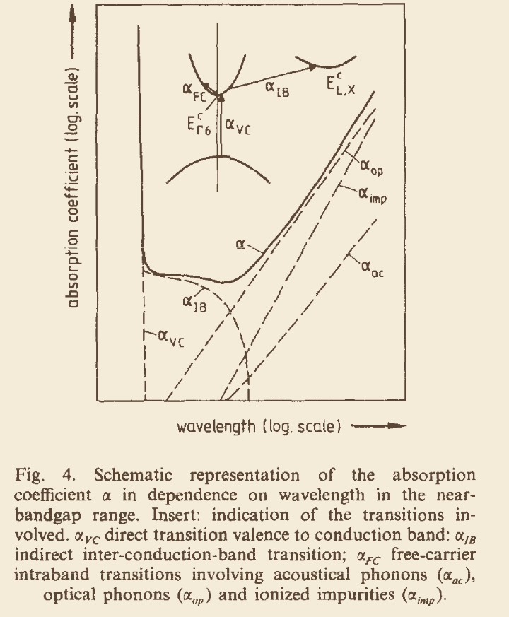
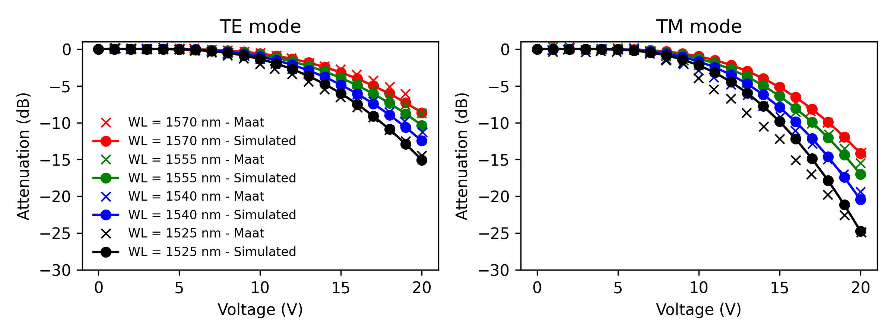

InGaAsPElectroOpticalModel
==========================

An ``ElectroOpticalModel`` is a ``PhotonicPolygon``-specific object that will calculate the change in optical permitivity, :math:`\Delta \epsilon`, locally, due to an applied electric field to your structure. These models are not meant to be used as a stand-alone package, but to be fed into a ``PhotonicPolygon``, which in turn `ElectroOpticalSimulator` will make use of to calculate the full electro-optical response. 

InGaAsP-based modulators are one of the most mature technologies in integrated photonics, which translates into well established models that predict the electro-optic response of these alloys. All of the models below are specific to alloys lattice matched to InP, where the :math:`x` can be predicted as:

.. math::

    x = \frac{y}{2.2020 - 0.659y}

In order to use many of the models, we first need to be able to predict some physical properties for all alloys. We will go over them one my one.

Effective mass
--------------

The effective masses are calculated according to :cite:t:`fiedler_optical_1987`:

.. math::

    \begin{align}
        m_e &= \left( 0.07 - 0.0308y \right)m_0 \\
        m_{hh} &= \left( 0.6 - 0.218y + 0.07y^2 \right)m_0 \\
        m_{lh} &= \left( 0.12 - 0.078y + 0.002y^2 \right)m_0
    \end{align}

where :math:`m_0` is the vacuum electron mass.

Carrier effective density of states
-----------------------------------

The effective density of states are calculated from :cite:t:`bennett_carrier-induced_1990`. For electrons we have:

.. math::

    N_C = 2 \left( \frac{m_e k_b T}{2\pi \hbar^2}\right)^{3/2}

and for holes:

.. math::

    N_v = 2 \left( \frac{m_h k_b T}{2\pi \hbar^2}\right)^{3/2}

with:

.. math::
    m_h = \left(m_{hh}^{1.5} + m_{lh}^{1.5}\right)^{2/3}

where :math:`k_b` is the boltzman constant, :math:`T` is the temperature and :math:`\hbar` is the planck constant.

Spin orbit splitting
--------------------

The spin orbit splitting is taken from :cite:t:`fiedler_optical_1987`:

.. math::
    \Delta_{so} = 0.119 + 0.30y - 0.107y^2 \hspace{1cm} [eV]

Bandgap narrowing
-----------------

The bandgap narrowing is a well known effect in III-V semiconductors, where it is observed that the bandgap of heavily doped materials shrinks. Here we follow the work of :cite:t:`jain_bandgap_1990` where the band gap narrowing (BGN) is estimated via:

.. math::
    \Delta E_g^{BGN} = A \times N^{1/3} + B \times N^{1/4} + C \times N^{1/2}

where :math:`N` is the carrier concentration and the constants :math:`A`, :math:`B` and :math:`C` have been empirically found for GaAs, GaP, InP and InAs, allowing for interpolation for InGaAsP alloys via :cite:t:`fiedler_optical_1987`:

.. math::
    Q(x,y) = xyQ_{GaAs} + x(1-y)Q_{GaP} + y(1-x)Q_{InAs} + (1-x)(1-y)Q_{InP}

The constants are:

.. list-table:: P-doped material
    :widths: 12 10 10 10
    :align: center
    :header-rows: 1

    * - Material
      - A :math:`\times 10^{-9}`
      - B :math:`\times 10^{-7}`
      - C :math:`\times 10^{-12}`
    * - GaAs
      - 9.83
      - 3.90
      - 3.90
    * - InAs
      - 8.34
      - 2.91
      - 4.53
    * - InP
      - 10.3
      - 4.43
      - 3.38
    * - GaP
      - 12.7
      - 5.85
      - 3.90

.. list-table:: N-doped material
    :widths: 12 10 10 10
    :align: center
    :header-rows: 1

    * - Material
      - A :math:`\times 10^{-9}`
      - B :math:`\times 10^{-7}`
      - C :math:`\times 10^{-12}`
    * - GaAs
      - 16.5
      - 2.39
      - 91.4
    * - InAs
      - 14.0
      - 1.97
      - 57.9
    * - InP
      - 17.2
      - 2.62
      - 98.4
    * - GaP
      - 10.7
      - 3.45
      - 9.97

Charge carrier mobility
-----------------------

Despite most commercial software for the simulation of charge transport in semiconductors have a good material database, III-V (in particular InGaAsP) materials seldom have a correct value for mobility, and in particular doping dependent mobility values. For that reason we will follow the empirical model of :cite:t:`sotoodeh_empirical_2000` for low field mobility:

.. math::

  \mu (N, T) = \mu_{min} + \frac{\mu_{max}(300K)\left(\frac{300K}{T}\right)^{\theta_1}-\mu_{min}}{1+\left(\frac{N}{N_{ref}(300K)\left(\frac{T}{300K}\right)^{\theta_2}}\right)^\lambda}

Where the values of :math:`\lambda_n`, :math:`\theta_{n2}`, :math:`\log_10{N_{n,ref}(300K)}`, :math:`\lambda_p`, :math:`\mu_{p, min}`, :math:`\theta_{p2}` and :math:`\log_10{N_{p,ref}(300K)}` for :math:`In_{1-x}Ga_{x}As_{y}P_{1-y}` are found via:

.. math::
  Q(In_{1-x}Ga_{x}As_{y}P_{1-y}) = yQ(In_{1-x}Ga_{x}As) + (1-y)Q(In_{1-x}Ga_{x}P)

The :math:`\mu_{n,max}(300K)`, :math:`\mu_{n,min}(300K)`, :math:`\mu_{p,max}(300K)`, :math:`\theta_{n1}`, :math:`\theta_{p1}` are found via:

.. math::
  Q(In_{1-x}Ga_{x}As_{y}P_{1-y}) = \frac{yQ(In_{1-x}Ga_{x}As) + (1-y)Q(In_{1-x}Ga_{x}P)}{1+my(1-y)}

with:

.. list-table::
    :widths: 8 8 8 8 8 8
    :align: center
    :header-rows: 1

    * - 
      - :math:`\mu_{n,max}(300K)`
      - :math:`\mu_{n,min}(300K)`
      - :math:`\mu_{p,max}(300K)`
      - :math:`\theta_{n1}`
      - :math:`\theta_{p1}`
    * - m
      - 6
      - 6
      - 6
      - 1
      - 1

Therefore, we just need to find the values for InGaAs and InGaP. To do so, we do a quadratic interpolation between each of the parameters, unless there are only two data points, in which case we do a linear interpolation. The values used are layed down in the tables below:

.. list-table:: InGaP parameter list
    :widths: 8 8 8 8
    :align: center
    :header-rows: 1

    * - x
      - 0
      - 0.51
      - 1
    * - :math:`\mu_{n, max}`
      - 5200
      - 4300
      - 152
    * - :math:`\mu_{n, min}`
      - 400
      - 400
      - 10
    * - :math:`N_{n, ref}`
      - log10(3e17)
      - log10(2e16)
      - log10(4.4e18)
    * - :math:`\lambda_{n}`
      - 0.47
      - 0.70
      - 0.80
    * - :math:`\theta_{n,1}`
      - 2.0
      - 1.66
      - 1.60
    * - :math:`\theta_{n, 2}`
      - 3.25
      - -
      - 0.71
    * - :math:`\mu_{p, max}`
      - 170
      - 150
      - 147
    * - :math:`\mu_{p, min}`
      - 10
      - 15
      - 10
    * - :math:`N_{p, ref}`
      - log10(4.87e17)
      - log10(1.5e17)
      - log10(1.0e18)
    * - :math:`\lambda_{p}`
      - 0.62
      - 0.80
      - 0.85
    * - :math:`\theta_{p,1}`
      - 2.0
      - 2.0
      - 1.98
    * - :math:`\theta_{p, 2}`
      - 3.0
      - -
      - 0.0

.. list-table:: InGaAs parameter list
    :widths: 8 8 8 8
    :align: center
    :header-rows: 1

    * - x
      - 0
      - 0.47
      - 1
    * - :math:`\mu_{n, max}`
      - 34000
      - 14000
      - 9400
    * - :math:`\mu_{n, min}`
      - 1000
      - 300
      - 500
    * - :math:`N_{n, ref}`
      - log10(1.1e18)
      - log10(1.3e17)
      - log10(6.0e16)
    * - :math:`\lambda_{n}`
      - 0.32
      - 0.48
      - 0.394
    * - :math:`\theta_{n,1}`
      - 1.57
      - 1.59
      - 2.1
    * - :math:`\theta_{n, 2}`
      - 3.0
      - 3.68
      - 3.0
    * - :math:`\mu_{p, max}`
      - 530
      - 320
      - 491.5
    * - :math:`\mu_{p, min}`
      - 20
      - 10
      - 20
    * - :math:`N_{p, ref}`
      - log10(1.1e17)
      - log10(4.9e17)
      - log10(1.48e17)
    * - :math:`\lambda_{p}`
      - 0.46
      - 0.403
      - 0.38
    * - :math:`\theta_{p,1}`
      - 2.3
      - 1.59
      - 2.2
    * - :math:`\theta_{p, 2}`
      - 3.0
      - 3.0
      - 3.0

Refractive index
----------------

The optical refractive index above the bandgap absorption edge is calculated via the modified single oscillator model through :cite:t:`fiedler_optical_1987`:

.. math::
  n^2 = 1+\frac{E_d}{E_0} + E_d \frac{E_d (\hbar \omega)^2}{E_0^3} + \frac{E_d}{2E_0^3(E_0^2 - E_g^2)} (\hbar \omega)^4ln\left[\frac{2E_0^2 - E_g^2 - (\hbar \omega)^2}{E_g^2 - (\hbar \omega)^2}\right]

where :math:`E_0` and :math:`E_d` are given by:

.. math::
  E_0 = 3.391 - 1.652y + 0.863y^2 - 0.123y^3

.. math::
  E_d = 28.91 - 9.278y + 5.626y^2

Whereas if any information above the bandgap is needed, we resort to the following formula from :cite:t:`seifert_revised_2016`:

.. math::
  \begin{aligned}
    n^* - 1 &\approx \frac{a}{b - (E + i\Gamma)^*} + \frac{A\sqrt{R}}{(E + i\Gamma)^*} 
    \Bigg\{ \ln \frac{E_z^*}{E_z^* - (E + i\Gamma)^*} + \pi \Bigg[ 2 \cot \left( \pi \sqrt{\frac{R}{E_z^*}} \right) \\
    &\quad - \cot \left( \pi \sqrt{\frac{R}{E_z^* - (E + i\Gamma)^*}} \right) - \cot \left( \pi \sqrt{\frac{R}{E_z^* + (E + i\Gamma)}} \right) \Bigg] \Bigg\}
  \end{aligned}

where:

.. math::
  \begin{aligned}
    R &= -0.00115 + 0.0191E_g \\
    \Gamma &= -0.000691 + 0.00433 E_g \\
    A &= -0.0453 + 2.1103 E_g \\
    a &= 72.32 + 12.78 E_g \\
    b &= 4.84 + 4.66 E_g \\
    c &= -0.015 + 0.02 E_g \\
    d &= -0.178 + 1.042 E_g
  \end{aligned}

Charge carrier electro-optic effects
------------------------------------

Now that we have defined all the necessary physical properties needed to do our calculations, we can finally dive deeper into the electro-optic effects that take place. We will start with the effects that are governed by the electrons and holes. We will not consider in extreme details the physics behind each effect, for that we reccomend you follow the cited references. Instead, we will focus on the models that are employed and their possible shortcomings.

Band filling effect
~~~~~~~~~~~~~~~~~~~

When doping a semiconductor with additional donors, the fermi level gets closer to the conduction band, which ultimately can cause the occupation of energy levels above the minimum of the conduction band to be occupied. This means that the excitation of electrons will only occur at higher energy levels than the bandgap energy. This change in the absorption spectrum will translate into a change in the refractive index via the Kramers-Kronig relations. For this effect we have found 2 works that seems to the most used throughout the literature: :cite:t:`bennett_carrier-induced_1990` and :cite:t:`vinchant_inpgainasp_1992`. In this package we allow the user to use either model, all of which complete with a model for :math:`\Delta \alpha(\lambda, y, N, P)` and :math:`\Delta n(\lambda, y, N, P)`.

Bennet's model with BGN
:::::::::::::::::::::::

Here we follow the work of :cite:t:`bennett_carrier-induced_1990`, with the difference that the quasi-fermi levels will be taken from numerical calculations of the charge transport simulator.

In this model, we do not consider the bandgap narrowing as a separate effect. Instead we consider it in-built into every model that is dependent on the bandgap value by considering :math:`E_g \to E_g - \Delta E_{BGN}`

.. math::
    \begin{aligned}
        \alpha(N,P,E) &= \frac{C_{hh}}{E} \sqrt{E - E_g - \Delta E_{BGN}} 
        \left[ f_v(E_{ah}) - f_c(E_{bh}) - 1 \right] \\
        &\quad + \frac{C_{lh}}{E} \sqrt{E - E_g - \Delta E_{BGN}} 
        \left[ f_v(E_{al}) - f_c(E_{bl}) - 1 \right]
    \end{aligned}

where :math:`f_v` and :math:`f_c` are the fermi-dirac distributions considering the fermi level as the quasi-fermi level for holes and electrons, respectively. :math:`E` is the energy of the incoming photon. The change in absorption is then given by:

.. math::
    \Delta \alpha(N,P,E) = \alpha(N,P,E) - \alpha_0

where:

.. math::
    \alpha_0(N,P,E) = \frac{C_{hh}}{E}\sqrt{E - E_g - \Delta E_{BGN}}  + \frac{C_{lh}}{E}\sqrt{E - E_g - \Delta E_{BGN}} 

The constants :math:`C_{hh}` and :math:`C_{lh}` are adapted from a constant :math:`C = 4.4e12 cm^{-1} s^{-0.5}` in :cite:t:`bennett_carrier-induced_1990`. 

.. warning::
    To determine the constants :math:`C_{hh}` and :math:`C_{lh}` for arbitrary concentrations of InGaAsP, we have adopted a new approach. We have noticed that in the work of :cite:t:`bennett_carrier-induced_1990`, the quaternary interpolation is done via the charge carrier masses alone. However, the parabolic absorption formula given by

    .. math::
        \alpha_0(N,P,E) = \frac{C}{E}\sqrt{E - E_g}

    tells us that the constant :math:`C` can be written as :cite:t:`moss_semiconductor_1973`

    .. math::
        C = \frac{2\pi e^2 (2m_r)^{3/2} |p_{m0}|^2}{3m_0^2 n_0 \epsilon_0 c h^3 \nu}

    we see that the constant is dependent on the refractive index as well, which will have an impact and is not accounted by Bennet. At the same time, :cite:t:`vinchant_inpgainasp_1992` states that a scaling factor is applied to the absorption spectrum so as to fit measurements at :math:`E_g + 0.2eV`, however, such scaling factor is not disclosed. For these reasons we have decided to employ a new model.

The reduced mass of the electron-heavy/light hole pairs is:

.. math::
    \begin{aligned}
        m_{r, ehh} &= \left(\frac{1}{m_e} + \frac{1}{m_hh}\right) \\
        m_{r, elh} &= \left(\frac{1}{m_e} + \frac{1}{m_lh}\right)
    \end{aligned}

The constants :math:`C_{hh}` and :math:`C_{lh}` are now calculated as:

.. math::
    C_{hh} = C \frac{m_{r,hh, InP}^{3/2}}{m_{r,hh, InP}^{3/2} + m_{r,lh, InP}^{3/2}} \left(\frac{m_{r, hh}}{m_{r,hh,InP}}\right)^{3/2} \frac{n_{0,InP}}{n_0}

.. math::
    C_{lh} = C \frac{m_{r,lh, InP}^{3/2}}{m_{r,hh, InP}^{3/2} + m_{r,lh, InP}^{3/2}} \left(\frac{m_{r, lh}}{m_{r,lh,InP}}\right)^{3/2} \frac{n_{0,InP}}{n_0}

The change in refractive index can now be calculated via the Kramers-Kronig integral. We have found, in accordance to the literature :cite:`vinchant_inpgainasp_1992`, that for all relevant alloys, the dependence with carrier concentration is linear. Therefore, we now emply the following slopes from :math:`\Delta n = m_n N + m_p P`:

To enable efficient simulation, we have generated a 3 dimensional array for both P and N dopants with::

  wl_values = np.linspace(1280,1650, 10) #wavelength in nm
  y_values=[0,0.1,0.2,0.3,0.4,0.53,0.6,0.7,0.8] #As concentration
  doping=10**np.linspace(16,18,10) #P or N doping in cm^-3

And we can create a ``scipy.interpolate.RegularGridInterpolator`` for both :math:`\Delta \alpha(\lambda, y, N, P)` and :math:`\Delta n(\lambda, y, N, P)`.

Bennet's model without BGN
:::::::::::::::::::::::

This model is exactly the same as the one above, with the exception that the bandgap narrowing is excluded. 

Vinchant's model
::::::::::::::::

Vinchan't model :cite:t:`vinchant_inpgainasp_1992` follows the same methodology as Bennet's model, with the exception that the bandgap narrowing effect is not accounted for in the absorption coefficient calculation, and a phenomenological scaling factor is applied to the absorption spectrum so as to fit measurements at :math:`E_g + 0.2eV`. However, such scaling factor is not disclosed in the paper, which has made the exact replication of their results hard. For this reason, we implement this model by resorting to digital data extraction for figure 4 from the paper and subsequently build a limited interpolator. The limiting factor in this model is the wavelength dependence, as we are bound to only 2 data point for 1300nm and 1520nm.

Model comparison
::::::::::::::::

Given these 3 models, it is up to the user to select which one they prefer. In the figure below we plot the approximated linear slope for the relation :math:`\Delta n = A(\lambda) N`. We can see that when :math:`N>10^{17} cm^{-3}`, the inclusion of the BGN effect creates a large deviation between the models. On the other hand, ignoring the BGN effect will lead to a better match of the models acrross a wider range of the carrier concentrations. Despite this mismatch in the models, The cases where the bandfilling effect is leveraged will rely on doping concentrations :math:`N<10^{17} cm^{-3}` such that carriers can be efficiently depleted with reasonable voltages (i.e. far away from breakdown voltage). For this reason, it is not too important which model to consider, as long as the user is aware keeps the doping concentrations within a reasonable range.

.. list-table::
   :widths: 50 50
   :class: image-row

   * - .. figure:: images_ingaasp/vinchant_vs_model_bgn.png
          :width: 100%

          Comparison betweem Vinchant's model and Bennet's model with BGN.

     - .. figure:: images_ingaasp/vinchant_vs_model_no_bgn.png
          :width: 100%

          Comparison betweem Vinchant's model and Bennet's model without BGN.

Plasma effect
~~~~~~~~~~~~~

The plasma effect considered in this package is in fact an umbrella term used to account for several contributions to the change in absorption caused by free carriers, namely:

- :math:`\alpha_{imp}`: the loss due to scattering of electrons with ionized impurities
- :math:`\alpha_{op}`: the loss due to scattering of electrons with optical phonons
- :math:`\alpha_{ac}`: the loss due to scattering of electrons with acoustic phonons
- :math:`\alpha_{IB}`: the loss due to intraband absorption, which is the case when an electron at the :math:`\Gamma` valley is excited to the :math:`X` or :math:`L` valleys.
- :math:`\alpha_{VC}`: The loss from direct interband transitions, which is the case when a valence electron is excited directly through the bandgap

The intervalence absorption effect is considered as a separate effect and will be explored later.

   Image retrieved from :cite:t:`fiedler_optical_1987`, which shows the different contributions to the change in absorption due to free carriers.

We follow the model from :cite:t:`walukiewicz_electron_1980`, which is in accordance with :cite:t:`dumke_intra-_1970`, for the estimation of :math:`\alpha_{imp}`, :math:`\alpha_{op}`, and :math:`\alpha_{ac}`. The change in absorption is given by:

.. math::
    \Delta \alpha(N, \lambda) = A_{\text{imp}}(N)\left(\frac{\lambda}{\lambda_0}\right)^{3.5} 
    + A_{\text{op}}(N)\left(\frac{\lambda}{\lambda_0}\right)^{2.5} 
    + A_{\text{ac}}(N)\left(\frac{\lambda}{\lambda_0}\right)^{1.5}

where :math:`\lambda_0 = 10\mu m`, and the constants :math:`A_{imp}`, :math:`A_{op}`, :math:`A_{ac}` are interpolated from:

.. list-table:: 
   :align: center
   :header-rows: 1

   * - :math:`N \ (\text{cm}^{-3})`
     - :math:`A_{\text{imp}}`
     - :math:`A_{\text{op}}`
     - :math:`A_{\text{ac}}`
   * - 1.0e16
     - 0.004
     - 0.623
     - 0.034
   * - 1.5e16
     - 0.008
     - 0.932
     - 0.052
   * - 2.0e16
     - 0.014
     - 1.239
     - 0.069
   * - 3.0e16
     - 0.031
     - 1.850
     - 0.104
   * - 4.0e16
     - 0.056
     - 2.456
     - 0.139
   * - 5.0e16
     - 0.086
     - 3.051
     - 0.173
   * - 6.0e16
     - 0.123
     - 3.646
     - 0.208
   * - 7.0e16
     - 0.167
     - 4.240
     - 0.243
   * - 8.0e16
     - 0.217
     - 4.815
     - 0.278
   * - 9.0e16
     - 0.273
     - 5.397
     - 0.313
   * - 1.0e17
     - 0.314
     - 5.578
     - 0.325
   * - 1.5e17
     - 0.690
     - 8.227
     - 0.491
   * - 2.0e17
     - 1.201
     - 10.79
     - 0.660
   * - 3.0e17
     - 2.602
     - 15.75
     - 1.005
   * - 4.0e17
     - 4.474
     - 20.52
     - 1.360
   * - 5.0e17
     - 6.790
     - 25.16
     - 1.726
   * - 6.0e17
     - 9.510
     - 29.65
     - 2.100
   * - 7.0e17
     - 12.64
     - 34.11
     - 2.488
   * - 8.0e17
     - 16.13
     - 38.44
     - 2.879
   * - 9.0e17
     - 20.00
     - 42.75
     - 3.285
   * - 1.0e18
     - 24.22
     - 47.01
     - 3.699
   * - 1.5e18
     - 50.28
     - 67.80
     - 5.912
   * - 2.0e18
     - 93.91
     - 88.02
     - 8.354
   * - 3.0e18
     - 170.3
     - 127.0
     - 13.87
   * - 4.0e18
     - 276.7
     - 164.1
     - 20.12
   * - 5.0e18
     - 396.1
     - 199.6
     - 26.98
   * - 6.0e18
     - 522.8
     - 233.4
     - 34.34

As for the change in refractive index, we consider the simple Lorentz model:

.. math::
    \Delta n(E) = -\frac{1}{2}  \frac{N e^2}{m_e \epsilon_0 (E/\hbar)^2 n_0}

For the intraband absorption, :math:`\alpha_{IB}`, we follow the treatment by :cite:t:`fiedler_optical_1987` and compute the following integral:

.. math::
  \begin{aligned}
   \alpha_{IB} ={}&
   A m_e^{3/2}
   \frac{E_{ac} E_{def}}{n \rho s^2}
   \frac{1}{\exp(E_{ac}/kT) - 1}
   \frac{1}{(E_{20} - \hbar \omega)^2 \hbar \omega}
   \\[6pt]
   &\times \left\{
   \exp(E_{ac}/kT)
   \int_{u^+}^{\infty}
   \frac{
      E^{1/2}
      (E - E_{10} + \hbar \omega + E_{ac})^{1/2}
   }{
      \exp[(E - E_F)/kT] + 1
   } \, dE
   \right.
   \\[6pt]
   &\qquad
   \left.
   + \int_{u^-}^{\infty}
   \frac{
      E^{1/2}
      (E - E_{10} + \hbar \omega - E_{ac})^{1/2}
   }{
      \exp[(E - E_F)/kT] + 1
   } \, dE
   \right\}.
   \end{aligned}

Please refer to :cite:t:`fiedler_optical_1987` for the definition of all the constants employed.

Finally, for the interband absorption, :math:`\alpha_{VC}`, we follow again the work of :cite:t:`fiedler_optical_1987` and compute the following integral:

.. math::
  \alpha_{VC} = 3.0\times 10^3 e^{-100(E_g - \hbar \omega)}

Intervalence absorption
~~~~~~~~~~~~~~~~~~~~~~~

The bandstructure of InGaAsP has two valence bands (light and heavy holes) and a third band due to the spin-orbit coupling. When a photon hits such a material which is hevily P-doped, it can cause an electron in the spin-orbit valence band to jump to one of the hole bands. This effect can be quite intense in III-V at 1550nm because the :math:`\Delta_{so} < 0.8eV`. In IngaAsP materials, this effect has been thorougly characterized, and here we employ the model from :cite:t:`weber_optimization_1994`:

.. math::
    \Delta \alpha(E,N) = 4.252\times 10^{-20} \exp \left(-3.657 E\right) P

.. math::
    \Delta n(E,N) = -\frac{\hbar c \alpha_0}{\pi} \frac{1}{2E}\left(e^{-bE}E_i(bE) + e^{bE}E_1(bE)\right) P 

where :math:`\alpha_0 = 4.252\times 10^-20 m^2` and :math:`b = 3.657 eV^{-1}`. :math:`E_i` and :math:`E_1` are the exponential integrals.

Field effects
-------------

In InGaAsP materials you have a linear and a quadratic field effect.

Pockels effect
~~~~~~~~~~~~~~

The pockels effect follows the works of :cite:t:`adachi_internal_1983` and :cite:t:`adachi_linear_1984`. The electro-optic coefficient :math:`r_{41}` is given by the sum of the free and piezoelectric contributions. Namely:

.. note::
    For simplicity, here we will not write the :math:`\Delta E_{BGN}` contribution, but consider it implied.

.. math::
    r_{41, free} = -\frac{1}{\epsilon_r^2} \left(E_0 g\left(\frac{E}{E_g}\right) + F_0\right)

.. math::
    \begin{aligned}
    r_{41, \text{piezo}} &= 
    - \frac{1}{\epsilon_r^2} 
    \Bigg( 
        C \bigg( 
            -g\left(\frac{E}{E_g}\right) 
            + 4 \frac{E_g}{\Delta_{\text{so}}} 
            \bigg[ 
                f\left(\frac{E}{E_g}\right) \\
            &\quad - \left(\frac{E_g}{E_g + \Delta_{\text{so}}}\right)^{1.5} 
                f\left(\frac{E}{E_g + \Delta_{\text{so}}}\right) 
            \bigg] 
        \bigg) 
        + D 
    \Bigg) e_{14}
    \end{aligned}

where 

.. math::
    g(\chi) = \frac{1}{\chi^2} \left( 2 - (1 + \chi)^{-0.5} - (1 - \chi)^{-0.5} \right)

.. math::
    f(\chi) = \frac{1}{\chi^2} \left( 2 - (1 + \chi)^{0.5} - (1 - \chi)^{0.5} \right)

The constants :math:`E_0`, :math:`F_0`, :math:`C`, :math:`D` are found via interpolation as:

.. math::
    Q(x,y) = xyQ_{GaAs} + x(1-y)Q_{GaP} + y(1-x)Q_{InAs} + (1-x)(1-y)Q_{InP}

and the constants for the binaries are found in the table below:

.. list-table:: Constants for materials
    :align: center
    :header-rows: 1

   * - Constant
     - InP
     - GaP
     - GaAs
     - InAs
   * - E0 (m V^-1)
     - -42.06e-12
     - -83.31e-12
     - -71.48e-12
     - -30.23e-12
   * - F0 (m V^-1)
     - 91.32e-12
     - 16.60e-12
     - 123.16e-12
     - 197.88e-12
   * - C (m^2 N^-1)
     - -0.36e-10
     - -0.06e-10
     - -0.21e-10
     - -1.48e-10
   * - D (m^2 N^-1)
     - 2.60e-10
     - 1.92e-10
     - 2.12e-10
     - 2.32e-10

Kerr effect
~~~~~~~~~~~

The kerr effect is due to the Franz-Keldysh effect, which causes a ripple in the absorption band-edge, which translates to a quadratic change in the refractive index. Here, we follow the work of :cite:t:`maat_inp-based_2001` and :cite:t:`hagnElectroopticEffectsTheir2001`. 

Real part
:::::::::

We start with the real part of the the change in permitivity. For this component we follow the phenomenological description of the the Kerr effect and we consider the change in the index ellipsoind constants as:

.. math::
  \Delta\left(\frac{1}{n^2}\right)_i
   =
   \sum_{l,m=x,y,z}
   S_{ilm} E_l E_m
   \qquad (i=1,\ldots,6),

where the S tensor, follows the voigt contracted notation and for isotropic crystals with :math:`\bar{4}3m` symmetry is given by:

.. math::
  \mathbf{S} =
   \begin{pmatrix}
   S_{11} & S_{12} & S_{12} & 0 & 0 & 0 \\
   S_{12} & S_{11} & S_{12} & 0 & 0 & 0 \\
   S_{12} & S_{12} & S_{11} & 0 & 0 & 0 \\
   0 & 0 & 0 & S_{44} & 0 & 0 \\
   0 & 0 & 0 & 0 & S_{44} & 0 \\
   0 & 0 & 0 & 0 & 0 & S_{44}
   \end{pmatrix}

where :math:`S_{44} = S_{11} - S_{12}`. The :math:`S_{12,11}` are given by:

.. math::
  S_{12,11} = C_{TE,TM} \frac{E_{photon}^2}{n^4(E_g^2-E_{photon})}

where the constants :math:`C_{TE,TM}` have been found to be 

.. math::
  \begin{aligned}
        C_{TE} &= -3.10\times 10^{-18} eV^2 m^2 V^{-2} \\
        C_{TM} &= -5.60\times 10^{-18} eV^2 m^2 V^{-2}
  \end{aligned}

.. warning::
  In :cite:t:`maat_inp-based_2001`, in the main text it is claimed that with experimental data retrieved with the COBRA platform which uses Q1.3 as the core material, and with the wavelength of 1.55um, the values of :math:`S_{11}` and :math:`S_{12}` are

  .. math::

    \begin{aligned}
    S_{11} &= 21.5\times10^{-20}\,\mathrm{m^2/V^2} \\
    S_{12} &= 11.9\times10^{-20}\,\mathrm{m^2/V^2}
    \end{aligned}

  These values, however, are accompanied by some inconsistencies. The first
  arises from direct inspection of the plots presented (Figure 3.3). Looking at the Q1.3  curve, we obtain

  .. math::

    \begin{aligned}
    S_{11} &= 18.3\times10^{-20}\,\mathrm{m^2/V^2}, &
    S_{12} &= 10.5\times10^{-20}\,\mathrm{m^2/V^2},
    \end{aligned}

  corresponding to deviations of 14\% and 11\%, respectively.

  Secondly, following the formula given for the coefficients, we would use

  .. math::

    C_{TE} = 1.79\times10^{-18}\,\mathrm{eV^2\,m^2/V^2},
    \qquad
    C_{TM} = 1.82\times10^{-18}\,\mathrm{eV^2\,m^2/V^2}.

  Combined with the refractive index :math:`n=3.35`, these values yield

  .. math::

    S_{11} = 6.86\times10^{-20}\,\mathrm{m^2/V^2},
    \qquad
    S_{12} = 6.98\times10^{-20}\,\mathrm{m^2/V^2},

  which not only eliminates any difference between TE and TM modulation, but
  also represents deviations of 42\% and 67\% from the reported experimental
  fit values.

  For these reasons, we take the reported values

  .. math::

    S_{11} = 21.5\times10^{-20}\,\mathrm{m^2/V^2},
    \qquad
    S_{12} = 11.9\times10^{-20}\,\mathrm{m^2/V^2}

  as the reference values and calculate :math:`C_{TE}` and :math:`C_{TM}`
  ourselves. This yields

  .. math::

    C_{TE} = 1.73\times10^{-18}\,\mathrm{eV^2\,m^2/V^2},
    \qquad
    C_{TM} = 3.13\times10^{-18}\,\mathrm{eV^2\,m^2/V^2}.

  .. figure:: images_ingaasp/maat_kerr.png
   :width: 50%
   :align: center

   Analysis of the quadratic electro-optic coefficients according to :cite:t:`maat_inp-based_2001`. The code to reproduce this image is found in :doc:`Benchmarks\Maat_2001\Kerr_real_part`

Imaginary part
::::::::::::::

The imaginary component of the Kerr effect has also been subject to customization as inconsistencies have been found in the literature. To best understand them, we shall compare the models adopted by :cite:t:`maat_inp-based_2001` and :cite:t:`hagnElectroopticEffectsTheir2001`. The change in absorption is then given by:

.. math::
  \begin{aligned}
   \text{(Maat)} \qquad & \Delta \alpha (E)_{TE,TM} = A_{TE,TM}\lambda \frac{|E_ext|}{E_g - E} 10^{-B_{TE,TM}\frac{(E_g-E)^{3/2}}{|E_{ext}|}} \\
   \text{(Hagn)} \qquad & \Delta \alpha (E)_{TE,TM} = C\frac{\mu_{TE,TM}}{E/\hbar}\frac{|E_{ext}|}{E_g-E}e^{-\frac{4}{3} 2\hbar \sqrt{\mu_{TE,TM}}\frac{(E_g-E)^{\frac{3}{2}}}{e |E_{ext}|}}
  \end{aligned}

Based on these equations, a number of inconsistencies have been found:

1. Comparing these two equations, we see that they demonstrate the same dependencies, with the incoming photon energy and material bandgap energy. However, :cite:t:`maat_inp-based_2001` aproach contains 4 fitting parameters, where :cite:t:`hagnElectroopticEffectsTheir2001` only contains 3. However, the constant :math:`C` from :cite:t:`hagnElectroopticEffectsTheir2001` contains a dependency on :math:`\mu_x \mu_y \mu_z` according to equation 3.37 and 3.23 from their main text. Therefore, Maat's approach is preferred.

2. In the main text from Hagn, it is mentioned that with :math:`C=4.8\times 10^{24}`, :math:`\mu_{TE}=0.037m_0` and :math:`\mu_{TM}=0.01m_0`, a good agreement between experiment and theoretical model is achieved. The constant :math:`C=4.8\times 10^{24}` is given without units and even with custom adjustments, reproducing the results from their Fig.4.4 was not possible.

3. Yet another attempt was made to fit the experimental data of :cite:t:`hagnElectroopticEffectsTheir2001` by following the work from :cite:t:`bennettElectrorefractionElectroabsorptionInP1987` and :cite:t:`aspnesElectricFieldEffects1967`. The fit was not successful.

4. The values reported in :cite:t:`maat_inp-based_2001` for :math:`B_{TE,TM}` and :math:`A_{TE,TM}` underestimate the electro-absorption and do not coincide with the change in absorption reported by :cite:t:`hagnElectroopticEffectsTheir2001` in Fig. 4.4 for the same detuning values (:math:`E_g-E`).

For these reasons, we have decided recreate the measurements done by :cite:t:`maat_inp-based_2001` in Fig.3.2 of the main text and manually fit the parameters :math:`A_{TE,TM}` and :math:`B_{TE,TM}` to the data. One additional constraint we have imposed is the fact that :math:`B_{TE}=B_{TM}`. The reason for this constraint stems from the theoretical treatment of :cite:t:`aspnesElectricFieldEffects1967` where the constant inside the exponential (i.e. :math:`B_{TE,TM}`) does not have any dependency on the incoming photon polarization, depending only on the reduced effective mass of the electron. The constant :math:`A_{TE,TM}`, on the other hand, has a dependency on the momentum matrix element :math:`|\rangle \psi_c|E \cdot p |\psi_v \rangle |`which in turn will lead to an optical anisotropic response. The adapted values are:

.. math::
  \begin{aligned}
    A_{TE} &= 0.26\times 10^{3} \quad \frac{eV}{Vm} \\
    A_{TM} &= 0.55\times 10^{3} \quad \frac{eV}{Vm} \\
    B_{TE,TM} &= 0.42\times 10^9 \quad \frac{V}{eV^{-3/2}m}
  \end{aligned}

   Results from the benchmark. The code to reproduce this plot can be found in :doc:`Benchmarks\Maat_2001\EO_simulation`

.. autoclass:: imodulator.ElectroOpticalModel.InGaAsPElectroOpticalModel
   :members:
   :special-members: __init__

References
----------

.. bibliography::
   :filter: docname in docnames
   :style: plain

